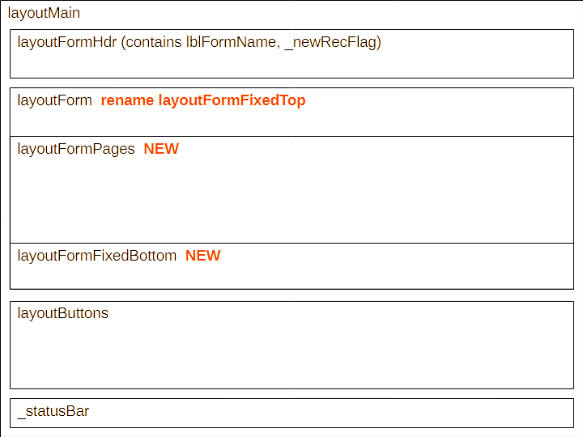

### Example
```python
class WorkOrdersRecord_multipage(cSimpleRecordForm):
    _ORMmodel = WorkOrders
    _ssnmaker = app_Session
    _formname = 'Work Orders'
    pages = ['Main', 'pg 2', 'Parts']
    fieldDefs = {
        'id': std_id_def,
        '@id': {'label': 'lookup ID', 'position': (0,1), 'lookupHandler': 'lookup_pk', 'widgetType': cComboBoxFromDict},
        'CIMSNum': {'label': 'CIMS Number', 'widgetType': QLineEdit, 'position': (2,0)},
        '@CIMSNum': {'label': 'lookup CIMS Number', 'position': (2,1), 'lookupHandler': 'lookup_CIMSNum', 'widgetType': cDataList},
        'WOMAid': {'label': 'WO/MA id', 'widgetType': QLineEdit, 'position': (3,0)},
        '@WOMAid': {'label': 'lookup WO/MA id', 'position': (3,1), 'lookupHandler': 'lookup_WOMAid'},
        'MRRequestor': {'label': 'MR Requestor', 'widgetType': QLineEdit, 'page': 'pg 2', 'position': (1,0,1,2)},
        'Project_id': {'label': 'Project', 'widgetType': cComboBoxFromDict, 'choices': sellL6ChoiceList.choices['Project'], 'page': 'pg 2', 'position': (1,3)},
        'notes': {'label': 'Notes', 'widgetType': QLineEdit, 'page': 'pg 2', 'position': (2,0,1,3)},
        'parts_needed': {'subform_class': WorkOrderPartsNeededSubForm, 'page': 'Parts', 'position': (1,0,1,3)},

        # subform - 'parts_needed': {'label': 'Parts Needed', 'widgetType': QLineEdit, 'position': (8,0)},
    }
```
### The \_\_init\_\_ s
```python
class cSimpleRecordForm(cSimpleRecordForm_Base):
    def __init__(self, 
        model: Type[Any]|None = None, 
        formname: str|None = None, 
        ssnmaker: sessionmaker[Session] | None = None, 
        parent: QWidget | None = None
        ):

class cSimpleRecordForm_Base(QWidget):
    _ORMmodel:Type[Any]|None = None
    _primary_key: Any
    _currRec: Any
    _newrecFlag: QLabel

    _ssnmaker:sessionmaker[Session]|None = None

    pages: List = []
    _tabindexTOtabname: dict[int, str] = {}
    _tabnameTOtabindex: dict[str, int] = {}
    fieldDefs: Dict[str, Dict[str, Any]] = {}

    def __init__(self, 
        model: Type[Any]|None = None, 
        ssnmaker: sessionmaker[Session] | None = None, 
        
        parent: QWidget | None = None
        ):
```

<div style="page-break-after: always;"></div>

### fieldDefs keywords

*   \# fldNameKey indicates a lookup field if the field name starts with '@'  
    \# lookup will be the boolean flag  
    \# fldName is the actual field name  
    isLookup = (fldNameKey[0] == '@')  
    fldName = fldNameKey if not isLookup else fldNameKey[1:]  

*   'subform_class', 'lookupHandler'
*   'label'. Defaults to the fldName if not given
*   'widgetType'. Defaults to QLineEdit if not given
    Supported widgetTypes are *xxx, yyy, zzz*
*   'align'. Default is Qt.AlignmentFlag.AlignLeft
*   'choices'. Default is None. Only makes sense if widgetType is **fill me in**
*   'initval'. Default is ''. Only makes sense if widgetType is **fill me in**
*   'lblChkBxYesNo'. Default is None. Dict **show struct of dict**. Only makes sense if widgetType is **fill me in**
*   'focusPolicy'. Default is Qt.FocusPolicy.ClickFocus if (isLookup or isSubFormElmnt) else None
*   'page'. Default is 0
*   'position'. Default is None. Must be a 2,3 or 4-tuple and is passed directly to fmLayout.addWidget. If not given or not a tuple with 2 or more elements, the field is not placed on the form

#### lesser-used keywords
*   'noedit'
*   'readonly'
*   'frame'
*   'maximumWidth'
*   'focusPolicy'
*   'tooltip'
*   'bgColor'

<div style="page-break-after: always;"></div>


